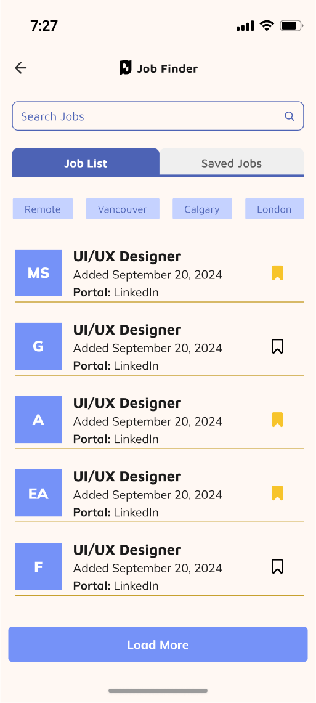
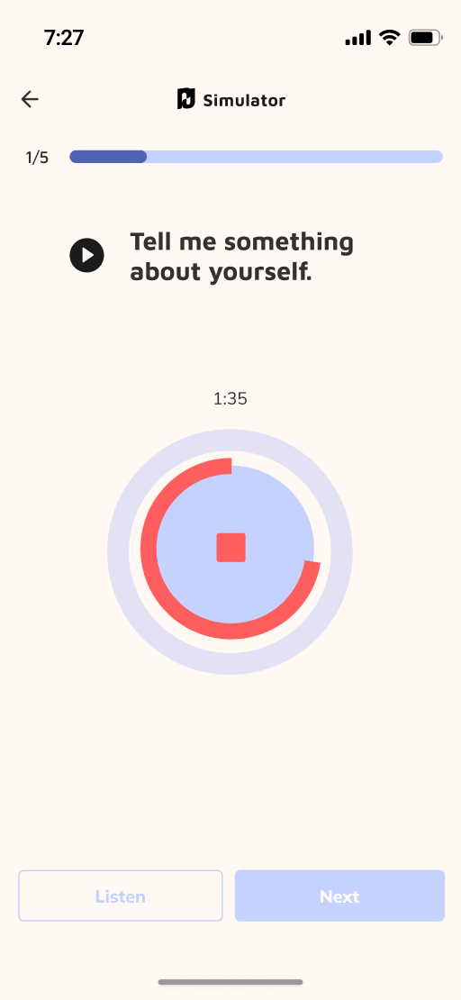
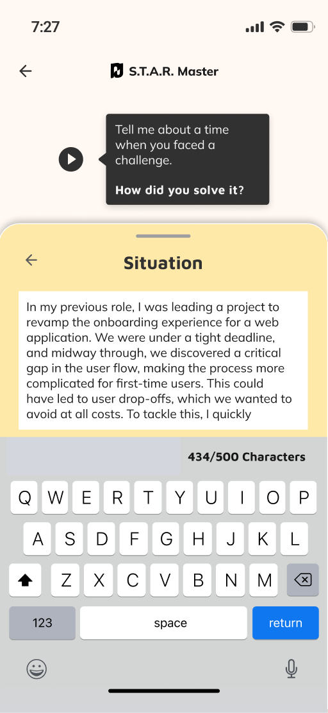
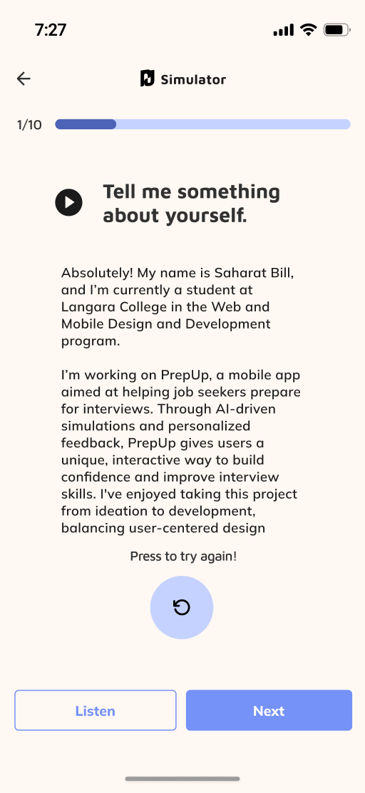
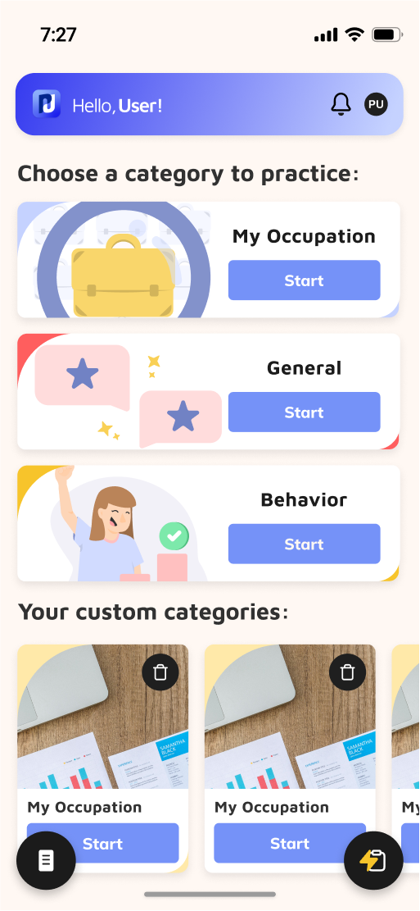

<div align="center">
  
</div>

# 🎯 PrepUp - AI-Powered Interview Preparation App

> A comprehensive React Native mobile application designed to revolutionize interview preparation through AI-powered question generation, real-time voice analysis, and personalized feedback.

[](https://reactnative.dev/)
[](https://expo.dev/)
[](https://www.typescriptlang.org/)
[](https://nodejs.org/)

## 📋 Table of Contents

- [🎯 Project Overview](#-project-overview)
- [🚀 Live Demo & Presentation](#-live-demo--presentation)
- [✨ Key Features](#-key-features)
- [🛠️ Technology Stack](#-technology-stack)
- [📱 Screenshots](#-screenshots)
- [🏗️ Architecture & Design](#-architecture--design)
- [🔧 Installation & Setup](#-installation--setup)
- [📊 Technical Highlights](#-technical-highlights)
- [🎓 Learning Outcomes](#-learning-outcomes)
- [🤝 Contributing](#-contributing)

## 🎯 Project Overview

**PrepUp** is a sophisticated interview preparation platform that leverages artificial intelligence to provide users with a comprehensive, interactive interview simulation experience. Built as my final term project for college, this application demonstrates advanced mobile development skills, AI integration, real-time processing, and modern software architecture principles.

### 🎯 Problem Statement
Traditional interview preparation methods often lack personalization, real-time feedback, and realistic simulation environments. Job seekers need a comprehensive platform that can:
- Generate relevant interview questions based on specific job descriptions
- Provide real-time voice recording and transcription
- Offer AI-powered analysis and feedback
- Create a gamified learning experience

### 💡 Solution
PrepUp addresses these challenges through:
- **AI-Powered Question Generation**: Custom interview questions based on job descriptions
- **Real-Time Voice Processing**: Live transcription and audio analysis
- **Comprehensive Feedback System**: Detailed analysis of fluency, confidence, clarity, and conciseness
- **STAR Method Training**: Structured approach to behavioral interview questions
- **Job Integration**: Direct connection to job search platforms

## 🚀 Live Demo & Presentation

### 🌐 Live Demo
**Experience PrepUp in action:**
- **🌍 LandingPage**: [https://prepup.ca/](https://prepup.ca/)
- **📱 Mobile App**: Available through Expo Go
- **📚 API Documentation**: [https://api.prepup.ca/api-docs](https://api.prepup.ca/api-docs)

### 🎥 Live Presentation
**Watch the live presentation:** [PrepUp Final Presentation](https://youtu.be/I-t8yMmM-2k?t=7311)

### 🔗 Repository Links
- **Frontend Repository**: [prepup-frontend](https://github.com/shunsaku-sugita/prepup-frontend)
- **Backend Repository**: [prepup-backend](https://github.com/shunsaku-sugita/prepup-backend)

## ✨ Key Features

### 🎤 **AI-Powered Interview Simulator**
- **Dynamic Question Generation**: Creates relevant questions based on job descriptions
- **Real-Time Voice Recording**: 2-minute recording sessions with live transcription
- **Audio Playback**: Review and analyze your responses
- **Progress Tracking**: Visual progress indicators throughout the interview

### 🎯 **STAR Method Master**
- **Structured Approach**: Situation, Task, Action, Result framework
- **Character Limit Tracking**: Real-time feedback on response length
- **Voice-to-Text**: Speak your responses for natural interaction
- **AI Analysis**: Get feedback on STAR method implementation

### 🔍 **Job Finder Integration**
- **Job Search**: Browse and filter job opportunities via Adzuna API
- **Bookmarking System**: Save interesting positions
- **Keyword Search**: Find relevant jobs by keywords
- **Direct Integration**: Seamless connection to interview preparation

### 📊 **Comprehensive Feedback System**
- **Multi-Dimensional Analysis**: 
  - Fluency Score & Feedback
  - Confidence Assessment
  - Clarity Evaluation
  - Conciseness Rating
- **Badge System**: Bronze, Silver, Gold achievements
- **Detailed Insights**: Specific improvement recommendations
- **Progress History**: Track improvement over time

### 🔐 **Advanced Authentication**
- **Multi-Platform Sign-In**: Email/password and Google authentication
- **Secure Token Management**: Expo SecureStore implementation
- **Password Reset**: Complete account recovery system
- **Profile Management**: User data and preferences

## 🛠️ Technology Stack

### **Frontend Framework**
- **React Native 0.74.5** - Cross-platform mobile development
- **Expo SDK 51** - Development platform and tools
- **TypeScript** - Type-safe development
- **Expo Router** - File-based navigation

### **Backend Infrastructure**
- **Node.js** - Server runtime environment
- **Express.js** - Web application framework
- **TypeScript** - Backend type safety
- **MongoDB** - NoSQL database with Mongoose ODM
- **Redis** - Caching and queue management
- **Socket.IO** - Real-time bidirectional communication

### **UI/UX & Styling**
- **NativeWind** - Tailwind CSS for React Native
- **Gluestack UI** - Component library
- **Expo Linear Gradient** - Visual effects
- **Custom Design System** - Consistent color palette and typography

### **State Management & Data**
- **React Context API** - Global state management
- **AsyncStorage** - Local data persistence
- **Socket.IO Client** - Real-time communication
- **Axios** - HTTP client for API communication

### **AI & Voice Processing**
- **OpenAI GPT API** - Question generation and analysis
- **Expo AV** - Audio recording and playback
- **React Native Voice** - Speech recognition
- **Real-time Transcription** - Live voice-to-text conversion

### **Authentication & Security**
- **Firebase Authentication** - User management
- **Google Sign-In** - OAuth integration
- **JWT Tokens** - Secure session management
- **bcrypt** - Password hashing
- **Expo SecureStore** - Secure token storage

## 📱 Screenshots

Here are a few snapshots of the PrepUp mobile application in action.

| Job Search | AI Interview | Answer Feedback |
| :---: | :---: | :---: |
|  |  |  |

| STAR Master | Audio Transcript | Home |
| :---: | :---: | :---: |
|  |  |  |

### Main Features
- **Splash Screen**: Animated video introduction
- **Category Selection**: Interview categories with custom cards
- **Interview Simulator**: Real-time voice recording interface
- **Feedback Dashboard**: Comprehensive analysis results
- **STAR Master**: Structured interview preparation
- **Job Finder**: Integrated job search functionality

## 🏗️ Architecture & Design

### **Full-Stack Architecture**
```
┌─────────────────┐    ┌─────────────────┐    ┌─────────────────┐
│   React Native  │    │   Web Client    │    │   Mobile App    │
│   Frontend      │    │   (prepup.ca)   │    │   (Expo Go)     │
└─────────────────┘    └─────────────────┘    └─────────────────┘
         │                       │                       │
         └───────────────────────┼───────────────────────┘
                                 │
                    ┌─────────────────┐
                    │   Node.js API   │
                    │   (Express.js)  │
                    └─────────────────┘
                                 │
         ┌───────────────────────┼───────────────────────┐
         │                       │                       │
┌─────────────────┐    ┌─────────────────┐    ┌─────────────────┐
│   MongoDB       │    │   Redis         │    │   OpenAI API    │
│   Database      │    │   Cache/Queue   │    │   AI Services   │
└─────────────────┘    └─────────────────┘    └─────────────────┘
```

### **User Flow Diagram**


### **Project Structure**
```
prepup-frontend/          # React Native Mobile App
├── app/                  # Expo Router pages
├── components/           # Reusable UI components
├── screens/              # Screen components
├── store/                # Context and state management
├── config/               # Configuration files
└── assets/               # Images, fonts, videos

```

### **Design Patterns**
- **Component-Based Architecture**: Modular, reusable components
- **Context API Pattern**: Global state management
- **Service Layer Pattern**: API abstraction
- **Custom Hook Pattern**: Logic reusability
- **Provider Pattern**: Theme and context providers
- **MVC Architecture**: Backend separation of concerns

### **Data Flow**
1. **User Authentication** → JWT token generation and storage
2. **Job Selection** → AI question generation via OpenAI API
3. **Voice Recording** → Real-time transcription and processing
4. **Audio Analysis** → AI-powered feedback generation
5. **Progress Tracking** → MongoDB persistence and Redis caching

## 🔧 Installation & Setup

### **Prerequisites**
- Node.js 20+
- Expo CLI
- MongoDB
- Redis
- iOS Simulator / Android Emulator / Physical Device
- Git

### **Frontend Setup**

1. **Clone the repository**
   ```bash
   git clone https://github.com/shunsaku-sugita/prepup-frontend.git
   cd prepup-frontend
   ```

2. **Install dependencies**
   ```bash
   npm install
   ```

3. **Start the development server**
   ```bash
   npx expo start
   ```

### **Backend Setup**

**Checkout README.md of backend repository**: [prepup-backend](https://github.com/shunsaku-sugita/prepup-backend)

## 📊 Technical Highlights

### **Advanced Features Implemented**

#### 🎤 **Real-Time Voice Processing**
- **Live Transcription**: Real-time speech-to-text conversion
- **Audio Recording**: High-quality audio capture with Expo AV
- **Voice Recognition**: React Native Voice integration
- **Audio Playback**: Review recorded responses

#### 🤖 **AI Integration**
- **Dynamic Question Generation**: Context-aware interview questions via OpenAI GPT
- **Answer Analysis**: Multi-dimensional feedback system
- **Natural Language Processing**: Response quality assessment
- **Personalized Recommendations**: Tailored improvement suggestions

#### 🔄 **Real-Time Communication**
- **WebSocket Integration**: Live progress updates via Socket.IO
- **Queue Management**: Redis-based background job processing
- **Progress Tracking**: Live interview session monitoring
- **Status Updates**: Real-time feedback delivery

#### 📱 **Cross-Platform Development**
- **iOS Support**: Native iOS features and optimization
- **Android Support**: Android-specific implementations
- **Web Compatibility**: Responsive web interface at [prepup.ca](https://prepup.ca/)
- **Universal Design**: Consistent experience across platforms

### **Performance Optimizations**
- **Lazy Loading**: Component and image optimization
- **Memory Management**: Efficient audio handling
- **Bundle Optimization**: Reduced app size
- **Caching Strategies**: Redis-based caching for improved performance
- **Database Indexing**: Optimized MongoDB queries

### **Security Implementations**
- **Secure Token Storage**: Expo SecureStore usage
- **API Authentication**: JWT token management
- **Password Hashing**: bcrypt implementation
- **Input Validation**: Comprehensive form validation
- **CORS Configuration**: Cross-origin resource sharing setup
- **Error Handling**: Graceful error management

## 🎓 Learning Outcomes

### **Technical Skills Developed**
- **Full-Stack Development**: Complete mobile and web application development
- **AI Integration**: OpenAI API implementation and optimization
- **Real-Time Processing**: WebSocket and audio processing
- **Database Design**: MongoDB schema design and optimization
- **API Development**: RESTful API design with comprehensive documentation
- **State Management**: Complex state handling with Context API
- **Cross-Platform Development**: iOS, Android, and Web deployment

### **Soft Skills Enhanced**
- **Project Management**: End-to-end project development
- **Problem Solving**: Complex technical challenges
- **Documentation**: Comprehensive code and project documentation
- **Presentation Skills**: Live demonstration and technical explanation
- **Team Collaboration**: Working with backend developers and designers

### **Industry-Relevant Experience**
- **Modern Development Practices**: Git workflow, code reviews, testing
- **API Design**: RESTful API consumption and error handling
- **UI/UX Design**: User-centered design principles
- **Performance Optimization**: Mobile app performance best practices
- **Security Awareness**: Authentication and data protection
- **Deployment**: Production deployment with PM2 and automated scripts

## 🤝 Contributing

This project was developed as a final term college project. While it's primarily a showcase of my skills, I welcome feedback and suggestions for improvement.

### **How to Contribute**
1. Fork the repository
2. Create a feature branch (`git checkout -b feature/AmazingFeature`)
3. Commit your changes (`git commit -m 'Add some AmazingFeature'`)
4. Push to the branch (`git push origin feature/AmazingFeature`)
5. Open a Pull Request

### **Code of Conduct**
- Be respectful and constructive
- Focus on technical improvements
- Provide clear explanations for suggestions
- Follow existing code style and patterns

---

## 📞 Contact & Links

- **Visit Official Site**: [prepup.ca](https://prepup.ca/)

---

**⭐ If you found this project helpful or impressive, please consider giving it a star!**

---
